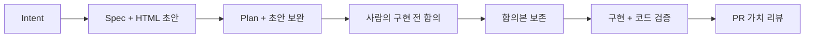
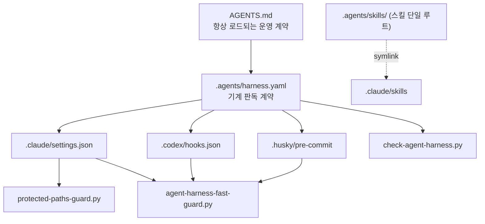

# __PROJECT_NAME__

코딩 에이전트(Claude Code · Codex)가 한 저장소 안에서 같은 방식으로 일하게 만드는 개발 하네스다.
세션마다 달라지는 작업 방식을 규약으로 고정하고, 저장소에는 규칙만 남기고 변경 하나의 이력은 PR 에
넘기며, 그 규약이 실제로 지켜졌는지는 사람의 리뷰가 아니라 훅과 스크립트가 판정한다.

이 저장소는 GitHub 템플릿이다. 프로젝트 고유 지식은 모두 `__UPPER_SNAKE__` 플레이스홀더로 빠져 있고,
`scripts/harness/init-template.sh` 가 한 번에 치환한다.

## 원칙

하네스에 무엇을 더하거나 뺄지는 네 원칙으로 판단한다 — ① 규칙만 저장소에, 이력은 PR 에
② 지침이 아니라 시스템으로 강제한다 ③ 사람이 보는 것은 인지부하를 최소로 ④ 사실은 에이전트가,
결정은 사람이 — 필요한 단계만. 정본은 `docs/standards/HARNESS_PRINCIPLES.md`.

## 왜 필요한가

에이전트는 세션이 바뀌면 맥락이 리셋된다. 어제 합의한 폴더 규칙도, 어제 지적받은 금지 사항도 남지 않는다.
규약을 프롬프트로 부탁하는 방식은 모델이 그 문장을 읽었는지, 읽고도 무시했는지 확인할 방법이 없다.
그래서 이 하네스는 두 가지를 분리한다. 판단이 필요한 것은 문서와 스킬로 두고,
절대 일어나면 안 되는 것은 훅과 가드 스크립트로 내린다. 설득은 문서가 하고, 강제는 훅이 한다.

## 어떻게 도는가 — 산출물 체인

변경 하나는 `docs/changes/<YYMMDD_NN>-<slug>/` 폴더 하나에 대응한다. 각 단계는 그 폴더에 파일을
남기고, 다음 단계는 앞 단계가 남긴 파일을 입력으로 받는다. **이 폴더는 로컬 전용이다** — 커밋하지
않고(`.gitignore` + fast guard 거절), 변경의 이력은 PR 설명(`pr.md`)과 PR 첨부가 담는다.
커밋과 계획은 `Plan-Ref: <YYMMDD_NN>-<slug>` 트레일러로 잇는다.



- 작은 변경은 더할 것이 없는 단계를 생략한다. 기존 HTML 적용 조건은 유지한다.
- 여러 앱·공유 계약 변경에는 설명서, UI 변경에는 목업·흐름·아키텍처까지 **구현 전에** 만든다.
  설명서를 입구로 네 관점을 연결해 사람이 무엇을 만들고 어떻게 할지 판단하게 한다.
- Intent · Spec은 전문을 보여주고 확인한다. Plan에서는 보완된 초안과 계획을 합의한 뒤
  agreement 스킬로 범위·검증 명령을 준비한다. 사용자의 승인 명령을 훅이 처리하고
  `agreements/<revision>/`에 합의본을 보존한다.
- 구현 후 코드 리뷰와 테스트는 합의 대비 동작을 확인한다. 실제 결과는 작업용 `deliverables/`에
  반영하고 합의본은 덮어쓰지 않는다. 여러 앱·공유 계약 변경의 코드 리뷰는 생략하지 않는다.
- PR은 **가치 리뷰**다. 합의한 기대와 실제 변화·증거를 대조하고, 미검증 가치는 지표·담당·시점을
  적는다. 구현 완료와 사람의 가치 승인을 구분한다. 본문은 기존처럼 짧게 유지한다.
- 질문은 단계별 선택형 게이트를 따른다. 상세 절차와 보장 범위는
  [AGREEMENT_REVIEW.md](docs/standards/AGREEMENT_REVIEW.md)에 있다.

단계별로 어떤 스킬이 도는지는 `AGENTS.md` 의 표가 정본이다.

## 4개 계층



| 계층 | 파일 | 하는 일 |
|---|---|---|
| 항상 로드 | `AGENTS.md`, `CLAUDE.md` | 모든 세션에 들어가는 운영 계약 (120줄 상한) |
| 앱별 | `apps/<app>/AGENTS.md` | 그 앱 아래에서 일할 때만 로드 (80줄 상한) |
| 온디맨드 | `.agents/skills/**` | 이름으로 호출하는 스킬 |
| 결정적 게이트 | `.claude/settings.json`, `.codex/hooks.json`, `.husky/pre-commit` | 모델 판단과 무관하게 도는 훅 |
| 산출물 | `docs/changes/**` | 변경마다 로컬에만 두는 의도·명세·계획 작업 폴더 (커밋 금지, 이력은 PR) |
| 회귀 | `.claude/evals/**` | 에이전트가 규칙을 따르는지 재는 행동 케이스 |

`.agents/harness.yaml` 이 계약의 단일 정본이고 호스트 파일은 그 어댑터다.
훅을 하나 추가하려면 `shared_hook_intents` 에 선언하고 해당 호스트 파일에 배선한다.
선언과 배선 중 하나만 있으면 `check:harness` 가 실패한다.

## 스킬 계층

스킬 루트는 `.agents/skills/` 하나다. `.claude/skills` 는 스킬당 심링크 하나로 건 미러이지 사본이 아니다.
벤더 스킬 16종은 상류 저장소에서 그대로 가져왔고, 손으로 고치지 않고
`python3 scripts/harness/vendor-skills.py --source <owner>/<repo>` 로 갱신한다
(`git-commit` · `draw-diagram` 은 상류가 없는 로컬 유틸리티라 이 갱신 대상이 아니다).
상류 스킬은 이 저장소의 변경 폴더 규칙·경로·산출 언어를 모르기 때문에,
체인의 각 단계마다 그것을 주입하는 프로젝트 어댑터 `__PREFIX__-*` 를 둔다.
어댑터가 감싸는 원본은 `user-invocable: false` 라서 슬래시 메뉴에는 어댑터만 보이고,
원본은 어댑터가 Skill 도구로만 호출한다. 사용자와 `AGENTS.md` 는 항상 어댑터를 거친다.

| 어댑터 | 감싸는 vendored 스킬 |
|---|---|
| `__PREFIX__-intent` | `grilling` |
| `__PREFIX__-spec` | `to-spec` |
| `__PREFIX__-tickets` | `to-tickets` |
| `__PREFIX__-implement` | `implement` |
| `__PREFIX__-ui-review` | `web-design-guidelines` |

## 검사는 스크립트가 한다

- `scripts/check-agent-harness.py` — `.agents/harness.yaml` 의 선언과 실제 호스트 파일이 어긋난 지점을 잡는다.
  선언만 있고 배선이 없는 훅, 어댑터가 감싸는데 호출 불가로 잠긴 스킬, 심링크가 아닌 스킬 미러 등.
- `scripts/agent-harness-fast-guard.py` — 변경 파일만 빠르게 훑는다. 활성 문서 루트 밖에 생긴 문서,
  사용자 홈 디렉터리가 박힌 절대경로, husky 훅이 배선되지 않은 체크아웃을 잡는다.
- `scripts/protected-paths-guard.py` — `protected_paths` 에 선언된 파일에 대한 에이전트의 편집을 PreToolUse 에서 막는다.
  `Edit`/`Write`/`MultiEdit` 는 경로로, `Bash` 는 명령 안의 쓰기 마커로 판정한다.
- `scripts/question-gate.py` — Intent · Spec · Plan 단계의 질문을 선택형으로 강제한다.
  라운드당 4개 이하, 단계 범주, 추천 선택지 먼저. 번호 나열식 질문으로 끝내려 하면 Stop 을 막는다.
- `scripts/pr-body-gate.py` — 짧은 가치 리뷰 형식과 비어 있지 않은 증거를 검사한다.
  HTML 적용 변경은 `Agreement-Ref`의 합의본 해시와 합의본/결과 HTML 존재를 확인한다.
  agreement 훅은 활성 변경의 `pr.md`를 직접 찾아 완료·커밋을 검사한다.
  실제 첨부·가치 판단·PR 게시는 사람이 한다.
- `scripts/agreement-gate.py` — Claude/Codex의 입력·도구 실행 전·종료 훅과 pre-commit에서
  승인, 정확한 파일 범위, 현재 코드의 검증 기록을 검사한다. 스킬은 준비·진행을 맡는다.
  신뢰·활성화된 훅이 필요하며 OS 보안 격리는 아니다.
- `scripts/harness/agreement-snapshot.py` — 승인 참조와 초안의 파일 해시를 보존한다.
  기존 리비전 덮어쓰기를 거절하고 `--check`로 합의본 변조·누락을 검출한다. 승인 자체를 인증하지는 않는다.
- `scripts/harness/check-plan-artifact.sh` — 여러 앱·공유 계약을 건드린 PR 에 `Plan-Ref` 커밋
  트레일러가 있는지 CI 에서 본다(기본 경고, `PLAN_GATE=enforce` 로 차단).

```sh
pnpm check:harness       # 계약 ↔ 호스트 파일 드리프트
pnpm test:harness        # 위 + 가드 회귀 테스트
pnpm evals:harness       # 에이전트가 실제로 규칙을 지키는지 (모델 호출)
```

`evals:harness` 만 따로 떨어져 있다. `claude -p` 로 실제 모델을 돌려 모델 쿼터를 쓰기 때문에
CI 기본 경로와 `test:harness` 에서 뺐다. 지시문을 고쳤을 때 손으로 돌린다.

## 시작하기

```sh
sh scripts/harness/init-template.sh --project-name <name> --prefix <prefix> --app <app>
pnpm install
pnpm test:harness
```

치환되는 플레이스홀더 전체 목록과 각 인자의 의미는 **[TEMPLATE_SETUP.md](./TEMPLATE_SETUP.md)** 의
플레이스홀더 표에 있다. 초기화 후 무엇을 손으로 채워야 하는지도 거기에 적혀 있다.

## 더 읽기

- [docs/standards/eli7-harness.html](./docs/standards/eli7-harness.html) — 하네스가 뭔지 그림으로 보는 설명. 사전 지식 없이 읽는다
- [TEMPLATE_SETUP.md](./TEMPLATE_SETUP.md) — 템플릿 설정, 플레이스홀더 표, 무엇을 일부러 뺐는지
- `docs/standards/AGENT_HARNESS.md` — 하네스 계약 해설. 하네스는 이 문서를 통해서만 바꾼다
- `.agents/harness.yaml` — 기계 판독 계약 정본
- `docs/standards/HARNESS_PRINCIPLES.md` — 하네스를 바꿀 때 비추는 네 원칙 정본
- `docs/changes/_templates/` — `intent.md` · `spec.md` · `plan.md` · `pr.md` 템플릿

## 라이선스 / 출처

`.agents/skills/` 의 벤더 스킬은 각 상류 저장소의 MIT 라이선스를 따른다.
출처와 갱신 명령은 `.agents/harness.yaml` 의 `skills.vendored` 에 선언되어 있다.

- `github.com/mattpocock/skills` (MIT)
- `github.com/vercel-labs/agent-skills` (MIT)
- `github.com/emilkowalski/skills` (MIT)

## 오래 유지할 결정은 ADR로

작업별 합의본과 PR은 변경 이력이고, [ADR](docs/decisions/README.md)은 다음 작업에도 영향을 주는
결정과 이유입니다. 구조·공유 계약·운영 정책·하네스 제어가 바뀔 때만 짧게 남깁니다.
기본 내용은 배경, 결정, 대안, 감수한 비용, 재검토 조건, 근거입니다. 모든 PR에 새 ADR을 요구하지 않습니다.

ADR 작성은 `__PREFIX__-adr` 스킬로 요청합니다. 기존 결정 재사용·새 기록 작성·대체를 지원하며,
Stop/pre-commit 훅이 필수 항목·상태·중복 번호·대체 참조를 검사합니다.
ADR의 필요성이나 결정의 타당성을 기계적으로 승인하는 기능은 아닙니다.

ADR을 직접 요청하지 않아도, 합의 준비 훅이 중요한 결정 후보를 에이전트에게 알려줍니다.
에이전트가 실제 내용과 기존 ADR을 확인한 뒤 필요한 기록을 먼저 제안합니다. 제안은 선택 사항입니다.
